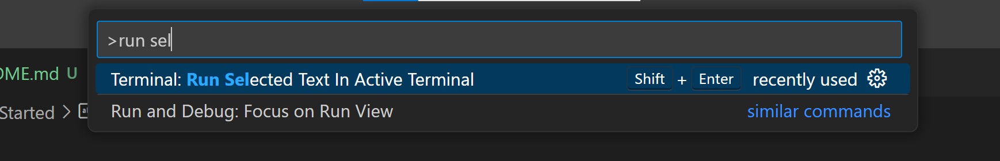

# Get Started

```shell
# open in Github Codespace

# start following notes in project folder
cd /workspaces/chkp-vmss-workshop/terraform
# open notes
code NOTES.md
```

### Hint:

Make your life easier with setting shortcut (e.g. `Shift-Enter`) for VS Code's *Run Selected Text in Active Terminal*

