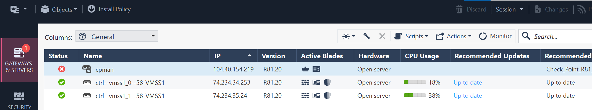

# 58-cross-region-lb

```bash
cd /workspaces/chkp-vmss-workshop/terraform

# check AZ permissions
az account list -o table
# if not logged in
az login
# might need az login --tenant <entra-id-tenantid> form of login as asked by Az CLI
az account list -o table

# all TF requires authenticad Azure API access - we do it based in Service Principal
# lets create SP first

cd /workspaces/chkp-vmss-workshop/terraform
chmod +x ./00-azsp/create-az-sp.sh
ls -l ./00-azsp/create-az-sp.sh
sudo apt update; sudo apt install -y dos2unix
dos2unix ./00-azsp/create-az-sp.sh
# cleanup from previous lab runs
rm ./sp-random.txt
# actual creation of SP
make sp
# it was stored here and used by rest of TF code
cat sp.yaml

# tf state should be remote, we need storage for it - storage account name has to be globally unique!!! (visit script for details)
cd /workspaces/chkp-vmss-workshop/terraform
# cleanup from previous lab runs
rm ./sa-random.txt
# actual creation of SA
dos2unix ./00-tfbackend/up.sh; chmod +x ./00-tfbackend/up.sh
make tfbackend


# approve image terms in azure marketplace
# az vm image terms accept --urn publisher:offer:sku:version
az vm image terms accept --urn checkpoint:check-point-cg-r8120:mgmt-byol:latest
# az vm image terms accept --urn Canonical:UbuntuServer:18.04-LTS:latest
az vm image terms accept --urn checkpoint:check-point-cg-r8120:sg-byol:latest

# deployment of VMSS is easy
# I have studied documentation of VMSS readme, cut&paste and customize few elements
# see https://github.com/CheckPointSW/CloudGuardIaaS/tree/master/terraform/azure/vmss-new-vnet
cd /workspaces/chkp-vmss-workshop/terraform
# this handles cleanup from previous lab runs
(cd /workspaces/chkp-vmss-workshop/terraform/01-vmss-a; rm -rf .terraform )
# tf init ;tf apply wrapped here:
make vmss1

# policy is pushed from management server. Lets get one in Azure
# can be done in parallel to VMSS deployment - in one more terminal
cd /workspaces/chkp-vmss-workshop/terraform
# cleanup from previous lab runs
(cd /workspaces/chkp-vmss-workshop/terraform/04-cpman; rm -rf .terraform )
# deploy : tf init ; tf apply wrapped here:
make cpman
# BTW this code was also created by cut&paste from readme at
# https://github.com/CheckPointSW/CloudGuardIaaS/tree/master/terraform/azure/management-new-vnet
# it deploys one more VNET dedicated to Check Point Management server

# BE PATIENT and monitor cpman VM serial console in Azure Portal until Gaia OS login prompt appears!
# start from VM list and choose "cpman"
# go to Serial Console under 

```
This is how Serial Console of cpman VM looks like (see Markdown preview in VScode)

It is showing First time configuration wizard (config_system) that continues with further setup steps and you should continue only once Serial Console is showing GaiaOS login prompt:


Security Management is now ready to use.
There is also easy way to get to the prompt:
```shell
make ssh
```

This created add-hoc SSH key and saved it to cpman using Check Point Management's `run-script` API.

It will also tell you Management IP address:
```
cpman_ip: 104.40.154.219
```
and lab password is:
```
Welcome@Home#1984
```

So you may open your SmartConsole R82.10 too.

## Azure Reader credentials for cpman

```shell
# reader SP would be useful for Azure inventory integration and CME - to bootstrap VMSS gw instances as they are created (e.g. on scale out)
cd /workspaces/chkp-vmss-workshop/terraform
# cleanup from previous lab runs
(cd /workspaces/chkp-vmss-workshop/terraform/03-reader; rm -rf .terraform )
# actual creation of Azure Reader service principal for CME (VMSS provisioning) and CG Controller (dynamic objects)
make reader
# reader is temporary SP, used only for inventory and CME - stored here
cat reader.json | jq .
# other TF code and CME will use it later

# lets check if VMSS is up and running
# our RGs
az group list --output table | grep 58-
# and 58-vmss1 should contain our VMSS
az vmss list --resource-group 58-vmss1 --output table

# lets check if management server is up and running
az group list --output table | grep 58-
# and 58-cpman should contain our cpman
az vm list --resource-group 58-cpman --output table

# what is cpman IP address?
az vm list-ip-addresses -g  58-cpman  -o json | jq -r '.[] | select(.virtualMachine.name == "cpman") | .virtualMachine.network.publicIpAddresses[0].ipAddress'
# user is admin, password is Welcome@Home#1984 ;-) - lets login
CPMAN_IP=$(az vm list-ip-addresses -g  58-cpman   -o json | jq -r '.[] | select(.virtualMachine.name == "cpman") | .virtualMachine.network.publicIpAddresses[0].ipAddress')

# once we have IP, we may login to cpman
echo $CPMAN_IP
ssh admin@$CPMAN_IP
# password is Welcome@Home#1984

# review VM initialization logs
ssh admin@$CPMAN_IP tail -f  /var/log/cloud_config.log 
ssh admin@$CPMAN_IP cat /var/log/cloud_config.log  | less

# visit cpman VM in Azure portal and check serial console
# https://portal.azure.com/#browse/Microsoft.Compute%2FVirtualMachines
# choose cpman and go to Serial Console

# confirm Mgmt is ready once API is ready
ssh admin@$CPMAN_IP api status
# under "Overall API Status:"
ssh admin@$CPMAN_IP api status | grep "API readiness "

# expecting:
# API readiness test SUCCESSFUL. The server is up and ready to receive connections
```

## Policy deployment

Even security policy can be managed by Terraform.
We will deploy policy package called "Azure" to cpman in following section.

```shell
# once it is the case, we may apply policy
cd /workspaces/chkp-vmss-workshop/terraform
# cleanup from previous lab runs
(cd /workspaces/chkp-vmss-workshop/terraform/05-policy; rm -rf .terraform )
# actual policy deployment
cat ./05-policy/policy_apply.sh
chmod +x ./05-policy/policy_apply.sh; dos2unix ./05-policy/policy_apply.sh
make policy


# also start SmartConsole and inspect new policy package called Azure; 
# see user sessions and potential uncommited changes
echo $CPMAN_IP
```
New policy package "Azure" is visible in SmartConsole:


### VMSS instances provisioning to Security Management

VMSS instances already exist in Azure, but they are not yet managed by Check Point Management.
CME is capable of adding them to management and pushing policy to them automatically.
CME needs to be configured to do so.

```shell

# see our VMSS instances in Azure
az vmss list --resource-group 58-vmss1 --output table

# once policy is in place, we need VMSS gw instances to be added to management by CME
cd /workspaces/chkp-vmss-workshop/terraform
chmod +x  ./06-cme/cme.sh; dos2unix ./06-cme/cme.sh

# this returns commands to be run on management server
make cme

# enter management and run them manually
chmod +x ./07-ssh/setup-ssh.sh; dos2unix ./07-ssh/setup-ssh.sh
make ssh


# ssh to cpman manuyally
CPMAN_IP=$(az vm list-ip-addresses  -o json | jq -r '.[] | select(.virtualMachine.name == "cpman") | .virtualMachine.network.publicIpAddresses[0].ipAddress')
# top secret lab password is: Welcome@Home#1984
ssh admin@$CPMAN_IP

# you may also use make ssh to beneft from add-hoc SSH key
make ssh

# cut and paste 2 autoprov_cfg commands
# copy one by one and restart CME only after second command

# once CME is restarted, you may check status in CME log
find /var -name cme.log
tail -f /var/log/CPcme/cme.log
```

CME running and disovering VMSS instances in Azure:


Once CME automatically created instaces also in management:


Azure inventory and Check Point Management server are now in sync:


**Summary**: 
CME is able to discover VMSS instances in Azure and add them to Check Point Management server.
It does SIC (Secure Internal Communication) and pushes policy to them automatically.
Only once instance has valid policy, health probe is passing and it is added to Azure Load Balancer pool.

Now we may test connectivity to VMSS instances.
We need machine in VMSS instances VNET to do so.


### Linux VM in VMSS protected VNET:

Make sure you are in correct folder and in Codespace terminal:

```shell
### linux1 VM
# dedicated TF folder
cd /workspaces/chkp-vmss-workshop/terraform/08-linux
# create Linux VM in VMSS VNET
make up
# later we may update routing table to involve VMSS towards Internet
make fwon

# once VM is up, we may login to it
# lets setup SSH with the key and ssh config first
mkdir -p ~/.ssh
terraform output -raw ssh_key > ~/.ssh/linux.key
cat ~/.ssh/linux.key
chmod og= ~/.ssh/linux.key
terraform output -raw ssh_config
terraform output -raw ssh_config | tee  ~/.ssh/config

# should get Ubuntu machine prompt simply by
ssh linux
# on linux
# create some traffic that can be seen on Check Point logs
counter=0; while true; do counter=$((counter+1)); echo ; echo "$counter"; curl ip.iol.cz/ip/ -m 2; echo; sleep 3; done
# notice that server responds with client public IP address
#   which can be either Linux instance IP or one of VMSS public IP

# some more traffic from linux
ping -c 3 1.1.1.1
ping -c 3 8.8.8.8

# back at devops workstation (Codespace)
# IP of linux VM
az group list --output table | grep 58-
LINUX_IP=$(az vm list-ip-addresses -g  58-linux  -o json | jq -r '.[] | select(.virtualMachine.name == "linux") | .virtualMachine.network.publicIpAddresses[0].ipAddress')
echo "Linux VM Public IP is $LINUX_IP"
# IP of VM instances in VMSS
az vmss  list-instance-public-ips -g 58-vmss1 -n vmss1 -o table


# devops workstation (Codespace)
cd /workspaces/chkp-vmss-workshop/terraform/
# route through FW (via LB)
make fwon

# check routing table
az network route-table route list -g 58-linux --route-table-name linux-rt-tf --output table
# AddressPrefix     HasBgpOverride    Name                NextHopType       ProvisioningState    ResourceGroup    NextHopIpAddress
# ----------------  ----------------  ------------------  ----------------  -------------------  ---------------  ------------------
# ----------------  ----------------  ------------------  -------------  -------------------  ---------------
# 0.0.0.0/0         False             to-internet         VirtualAppliance  Succeeded            58-linux         10.1.2.4

# route directly to Internet
make fwoff
# check routing table
az network route-table route list -g 58-linux --route-table-name linux-rt-tf --output table
# expected
# AddressPrefix     HasBgpOverride    Name                NextHopType    ProvisioningState    ResourceGroup
# ----------------  ----------------  ------------------  -------------  -------------------  ---------------
# 0.0.0.0/0         False             to-internet         Internet       Succeeded            58-linux

# RT may also be monitored with
watch -d 'az network route-table route list -g 58-linux --route-table-name linux-rt-tf --output table'
```

### Optional: CPHA deployment to VMSS1 VNET

```shell
# CPHA deployment
cd /workspaces/chkp-vmss-workshop/terraform
# cleanup from previous lab runs
(cd /workspaces/chkp-vmss-workshop/terraform/11-ha2vmss; rm -rf .terraform )
# actual deployment
make ha2vmss

# get topo and add-simple-cluster cmd
chmod +x /workspaces/chkp-vmss-workshop/terraform/11-ha2vmss/gettopo.sh
dos2unix /workspaces/chkp-vmss-workshop/terraform/11-ha2vmss/gettopo.sh
/workspaces/chkp-vmss-workshop/terraform/11-ha2vmss/gettopo.sh

# once it is up, we may check cluster members NIC IPs topology
az vm list-ip-addresses -g  58-ha2vmss  -o table

# notice ha1 owns cluster VIP - one extra IP

# VirtualMachine    PublicIPAddresses              PrivateIPAddresses
# ----------------  -----------------------------  ---------------------
# ha1               52.178.143.141,52.138.221.185  10.1.1.105,10.1.1.107
# ha1                                              10.1.2.106
# ha2               52.178.137.158                 10.1.1.106
# ha2                                              10.1.2.107

# az vm list-ip-addresses --resource-group MyResourceGroup --name MyVm
az vm list-ip-addresses -g  58-ha2vmss  -n ha1 -o table 

az vm list-ip-addresses -g  58-ha2vmss  -n ha2 -o table 

# in detail
az vm list-ip-addresses -g  58-ha2vmss  -n ha1 -o json
az vm list-ip-addresses -g  58-ha2vmss  -n ha2 -o json

# NICS:
az vm nic list --resource-group 58-ha2vmss --vm-name ha1
az vm nic list --resource-group 58-ha2vmss --vm-name ha2

az network nic show -g  58-ha2vmss -n ha1-eth0
az network nic show -g  58-ha2vmss -n ha1-eth1

az network nic show -g  58-ha2vmss -n ha2-eth0
az network nic show -g  58-ha2vmss -n ha2-eth1

az network nic show -g  58-ha2vmss -n ha1-eth0 | jq -r '.ipConfigurations[0]' 
az network nic show -g  58-ha2vmss -n ha1-eth0 | jq -r '.ipConfigurations[0].privateIPAddress'
az network nic show -g  58-ha2vmss -n ha1-eth0 | jq -r '.ipConfigurations[0].publicIPAddress.id'

az network public-ip show --ids $(az network nic show -g  58-ha2vmss -n ha1-eth0 | jq -r '.ipConfigurations[0].publicIPAddress.id')
# VIP
az network public-ip show --ids $(az network nic show -g  58-ha2vmss -n ha1-eth0 | jq -r '.ipConfigurations[1].publicIPAddress.id') | jq -r '.ipAddress'
```

### Cleanup
```shell
# new VMSS instance(s) should be added to management - appear in SmartConsole
# policy package Azure is pushed to them...

##########################################
# CLEANUP

# ha2vmms (optional)
cd /workspaces/chkp-vmss-workshop/terraform
make ha2vmss-down

# linux1 VM
cd /workspaces/chkp-vmss-workshop/terraform/08-linux
make down

# remove reader SP permissions
cd /workspaces/chkp-vmss-workshop/terraform
make reader-down

# remove management server
cd /workspaces/chkp-vmss-workshop/terraform
make cpman-down

# lets remove gateways in VMSS
cd /workspaces/chkp-vmss-workshop/terraform
make vmss1-down

# as last step, remove SP used for TF
cd /workspaces/chkp-vmss-workshop/terraform
make sp-down

# storage account used for TF state
cd /workspaces/chkp-vmss-workshop/terraform
make tfbackend-down

# note there was also shorter way to remove all resources
make down

# inspect related RGs (none should be left)
az group list --output table | grep 58-

```


### Unused:
```bash


# CME helpers on cpman
curl_cli -k -OL https://raw.githubusercontent.com/joe-at-cp/checkpoint-cme-helper/main/cme_helper.sh
curl_cli -k -OL https://raw.githubusercontent.com/joe-at-cp/checkpoint-cme-helper/main/gw_helper.sh
autoprov_cfg set management -cs /home/admin/cme_helper.sh
autoprov_cfg set template -tn vmss_template -ia -ips -cg /home/admin/gw_helper.sh

# yq
# curl -OL https://github.com/mikefarah/yq/releases/download/v4.44.2/yq_linux_amd64; chmod +x yq_linux_amd64
# yq() {
#   docker run --rm -i -v ${PWD}:/workdir mikefarah/yq yq $@
# }

cat sp.yaml | yq r - .


fw ctl set int cloud_balancer_port 0
fw ctl set int cloud_balancer_port 8117


$CPDIR/bin/cprid_util -server 108.143.208.96 -verbose rexec -rcmd /bin/bash -c  "cat /etc/fw/tmp/lb-health.sh"


mkdir www
hostname -i > www/index.html
cd www; python3 -m http.server 8081
 
 
for i in $(seq 10); do  curl  -k http://20.238.208.132 -m1 -s;  done | sort | uniq -c

CPMAN=$(az vm list-ip-addresses  -o json | jq -r '.[] | select(.virtualMachine.name == "cpman") | .virtualMachine.network.publicIpAddresses[0].ipAddress')
echo "CPMAN IP: $CPMAN"
ssh admin@$CPMAN

api status
mgmt_cli -r true show simple-gateways limit 50 offset 0 details-level "standard"  --format json

mgmt_cli -r true show simple-gateways limit 50 offset 0 details-level "full"  --format json | jq -r '.objects[]| [.name,."ipv4-address"]|@csv'

GWNAMES=$(mgmt_cli -r true show simple-gateways limit 50 offset 0 details-level "full"  --format json | jq -r '.objects[]| .name'); echo $GWNAMES

GWIPS=$(mgmt_cli -r true show simple-gateways limit 50 offset 0 details-level "full"  --format json | jq -r '.objects[]| ."ipv4-address"'); echo $GWIPS

GWIPS1=$(mgmt_cli -r true show simple-gateways limit 50 offset 0 details-level "full"  --format json | jq -r '.objects[]|select(.name|contains("VMSS1"))  | ."ipv4-address"'); echo $GWIPS1

GWIPS2=$(mgmt_cli -r true show simple-gateways limit 50 offset 0 details-level "full"  --format json | jq -r '.objects[]|select(.name|contains("VMSS2"))| ."ipv4-address"'); echo $GWIPS2

# OK
$CPDIR/bin/cprid_util -server 20.224.38.132 -verbose rexec -rcmd /bin/bash -c  "hostname -i"
#NOK
$CPDIR/bin/cprid_util -server ctrl--vmss1_4--58-VMSS1 -verbose rexec -rcmd /bin/bash -c  "hostname -i"

for i in $(echo $GWIPS | tr ' ' '\n'); do echo $i; $CPDIR/bin/cprid_util -server $i -verbose rexec -rcmd /bin/bash -c  "mkdir /home/admin/www;hostname -i>/home/admin/www/index.html; cat /home/admin/www/index.html"; done


for i in $(echo $GWIPS | tr ' ' '\n'); do echo $i; $CPDIR/bin/cprid_util -server $i -verbose rexec -rcmd /bin/bash -c  "cd /home/admin/www; python3 -m http.server 8081 &"; done

for i in $(echo $GWIPS1 | tr ' ' '\n'); do echo $i; $CPDIR/bin/cprid_util -server $i -verbose rexec -rcmd /bin/bash -c  "fw ctl set int cloud_balancer_port 0"; done

for i in $(echo $GWIPS1 | tr ' ' '\n'); do echo $i; $CPDIR/bin/cprid_util -server $i -verbose rexec -rcmd /bin/bash -c  "fw ctl set int cloud_balancer_port 8117"; done

for i in $(echo $GWIPS2 | tr ' ' '\n'); do echo $i; $CPDIR/bin/cprid_util -server $i -verbose rexec -rcmd /bin/bash -c  "fw ctl set int cloud_balancer_port 0"; done

for i in $(echo $GWIPS2 | tr ' ' '\n'); do echo $i; $CPDIR/bin/cprid_util -server $i -verbose rexec -rcmd /bin/bash -c  "fw ctl set int cloud_balancer_port 8117"; done


for i in $(echo $GWIPS | tr ' ' '\n'); do echo $i; curl_cli http://$i:8081 -s; done

# GLB
for i in $(seq 10); do  curl_cli  -k http://20.238.208.132 -m1 -s;  done | sort | uniq -c
while true; do echo; date; for i in $(seq 10); do  curl_cli  -k http://20.238.208.132 -m1 -s;  done | sort | uniq -c; done
# vmss1 NortEurupe
for i in $(seq 10); do  curl_cli  -k http://13.79.38.198 -m1 -s;  done | sort | uniq -c
# vmss2 WestEurope
for i in $(seq 10); do  curl_cli  -k http://108.143.45.211 -m1 -s;  done | sort | uniq -c
while true; do echo; date; for i in $(seq 10); do  curl_cli  -k http://13.80.16.223 -m1 -s;  done | sort | uniq -c; done
```